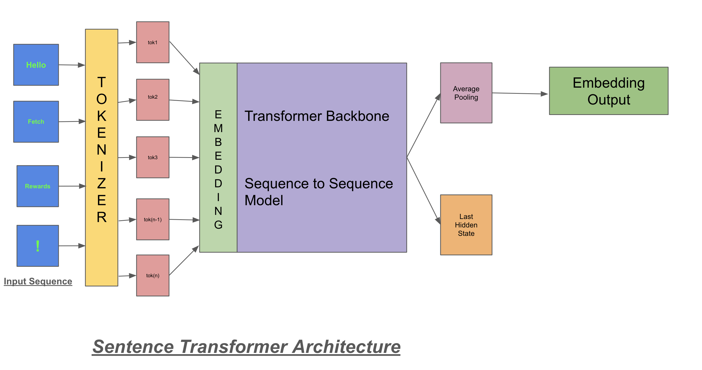
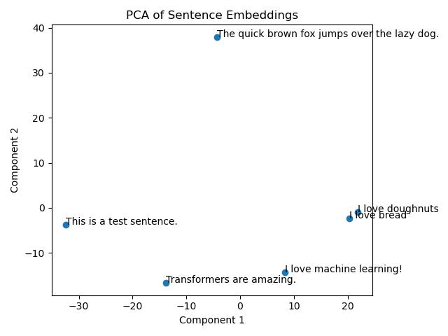
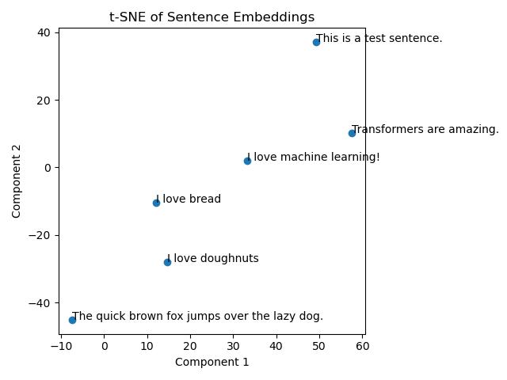
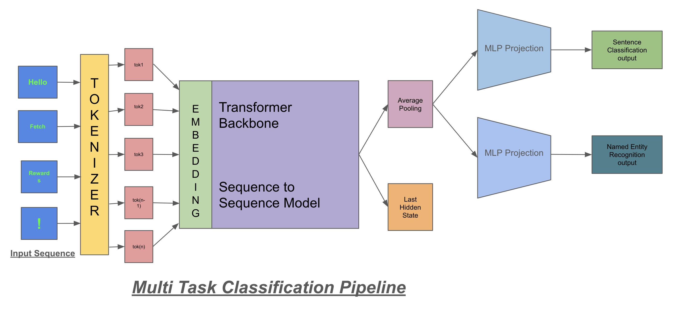
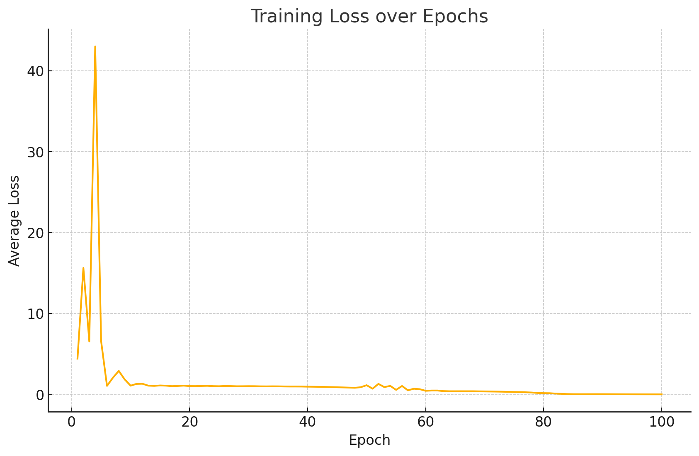
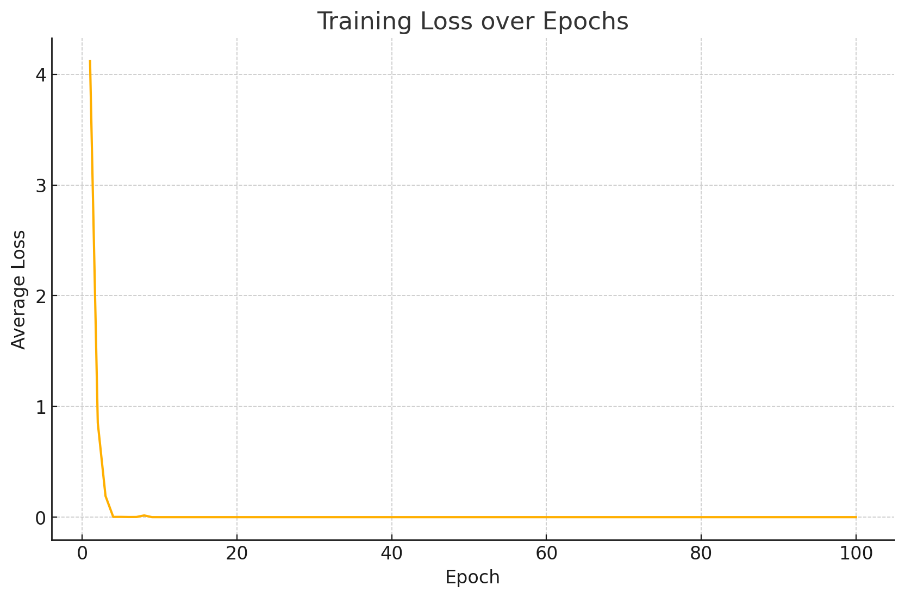

# Sentence Transformer

A modular pipeline for building and evaluating transformer-based sentence encoders and multi-task NLP models. Starting from a pretrained RoBERT/GPT-Neo backbone, this project demonstrates the followings:

- Generate fixed-length sentence embeddings from a pretrained RoBERT/GPT-Neo backbone  
- Extend the encoder with separate heads for sentence classification and named entity recognition  
- Analyze how different freezing and fine-tuning strategies affect model performance  
- Run a unified multi-task training loop for joint optimization of both tasks  


## Installation 

### 1. Using Docker

1. **Build the image**  
   From the project root:
   ```bash
   docker build -t sentence-transformer .
2. **Run the container**
   This will execute Task 1, Task 2 and Task 4 in order:
   ```bash
   docker run --rm sentence-transformer
### 2. Local Setup (without Docker)

1. **Clone the repository**  
   ```bash
   git clone https://github.com/cheersanimesh/sentence_transformer.git
   cd sentence-transformer
2. **Create the Conda environment**
    ```bash
    conda env create -f environment.yml
3. **Activate the environment**
    ```bash
    conda activate sentence-transformer
4. **Install Python dependencies**
    ```bash
    pip install -r requirements.txt
5. **Run the tasks**
    ```bash
    python task1.py
    python task2.py
    python task4.py
## Task 1: Sentence Transformer Implementation

### Model Architecture  


Our sentence encoder consists of three main components:

1. **BPE-Based Tokenizer**  
   - Uses Byte-Pair Encoding (BPE) to split text into subword units.  
   - **Why BPE?**  
     - Handles rare or out-of-vocabulary words by decomposing them into known subwords.  
     - Keeps vocabulary size manageable while minimizing “unknown” tokens.

2. **Pretrained RoBert/GPT-Neo Backbone**  
   We selected the `RoBERT/GPT-Neo 125M` model for their:  
   - **Rotary Positional Embeddings (RoPE):**  
     - Encodes relative token positions, improving generalization to varied sequence lengths.  
   - **Dense Self-Attention:**  
     - Captures rich, pairwise contextual dependencies essential for nuanced sentence meaning.  
   - **Open-Source & Scalable Architecture:**  
     - Easily scaled to larger sizes (e.g., 1.3B parameters) without changing code.

3. **Mean-Pooling → Projection → Normalization**  
   - **Mean-Pooling:** Averages the final hidden states into one fixed-length vector.  
   - **Linear Projection:** Maps the pooled vector down to a 512-dimensional embedding.  
   - **ℓ₂-Normalization:** Ensures all embeddings lie on the unit hypersphere, making cosine similarity meaningful.

---

### Embedding Demonstration

**Sample Sentences**  
- `The Quick fox jumps over the lazy dog.`
- `This is a test sentence.`
- `I love doughnuts.`
- `I love Machine Learning.`
- `I love bread`
- `Transfomers are amazing.`

We encoded these into 768-dim vectors and visualized them in 2D:

| **PCA Projection**                               | **t-SNE Projection**                             |
|:------------------------------------------------:|:------------------------------------------------:|
|          |         |

**Observation:**  
Semantically similar sentences (e.g., 
`Machine Learing vs Transformers` or. `doughnuts vs bread`) form tight clusters, confirming our model captures high-level meaning beyond surface token overlap.

---

### Design Choices & Rationale

- **Tokenizer:**  
  BPE balances vocabulary size and coverage, reducing unknown tokens. Helps in spelling errors.

- **Backbone:**  
   We are using RoBERTa because its fully bidirectional masked‑language‑modeling objective yields richer contextual representations by attending to both left and right context; 
   
   We also experiment with GPT‑Neo’s RoPE layer and self‑attention for efficient sentence‑level encoding; both being open‑source enables easy scaling and ablation across model sizes. 

- **Pooling + Projection:**  
  Mean‑pooling is simple and effective; a projection layer controls embedding dimension; ℓ₂‑normalization yields consistent similarity metrics.


## Task 2: Multi-Task Learning Expansion

The results and discussions are compiled in task2.md

### 2.1 Dummy Dataset  
We created a tiny toy dataset of 6 examples in `data/dummy_data.json`. Each entry has:  
- A raw sentence  
- A sentence‐level sentiment label (one of four classes)  
- A token‐level entity tag sequence (one of nine tags)  

Example entry:
```json
{
		"sentence": "Fetch Rewards is awesome and is America's number one app",
		"task_A": "technology",
		"task_B": [
		  { "text": "Fetch Rewards", "type": "ORG", "start": 0, "end": 13 },
		  { "text": "America", "type": "LOC", "start": 32, "end": 39 }
		]
}
```

### 2.2 Task Definitions  
1. **Sentence Classification (Sentiment)**  
   - **Labels (4):** `travel`, `technology`, `politics`, `other`  
   - **Output dim:** 4  

2. **Named Entity Recognition (NER)**  
   - **Tags (9):**  
     ```
     0: O
     1: B-PERSON
     2: I-PERSON
     3: B-LOC
     4: I-LOC
     5: B-ORG
     6: I-ORG
     7: B-DATE
     8: I-DATE
     ```  
   - **Output dim:** 9  

Both tasks share the same RoBERT/GPT-Neo encoder (from Task 1) but use separate projection heads.

### 2.3 Model Architecture  
  

- **Shared Encoder**  
  - `RoBERT/GPT-Neo 125M` (hidden_dim = 768)  

- **Sentence Classification Head**  
  ```python
  nn.Sequential(
      nn.Dropout(0.1),
      nn.Linear(hidden_dim, 4)
  )
  ```  
  - Applies to the pooled sentence embedding → 4-way sentiment logits.

- **NER Head**  
  ```python
  nn.Sequential(
      nn.Dropout(0.1),
      nn.Linear(hidden_dim, 9)
  )
  ```  
  - Applies token-wise to each of the `seq_len` hidden states → (batch, seq_len, 9) tag logits.

### 2.4 Initial Outputs & Next Steps  
On our untrained projection heads, a forward pass over the 6 dummy sentences yields tensor shapes:  
`class_logits.shape == (6, 4)`  
`ner_logits.shape  == (6, seq_len, 9)`  
### Sample Output

Sentence: The Yellowstone National Park sees over four million visitors.

- **[Task A] Predicted category:** technology  
- **[Task B] Predicted entities:**
  - **Yellowstone National Park** (LOC) — spans characters 4–31  


Although the predictions are random initially, this confirms our model produces correctly-shaped outputs for both tasks. 
> With training and fine-tuning, the model will jointly learn representations that serve both sentence-level and token-level objectives, improving generalization and parameter efficiency.  


## Task -3 Training Considerations

The results and discussions are compiled in task3.md

## Task -3 Training Considerations

### 3.1 Freezing the Entire Network
- **Definition**  
  No parameters—neither backbone nor task heads—are updated during training.
- **Use case**  
  - Pure feature extraction: use the pretrained model “as is” and train external classifiers.  
  - Quick baseline to gauge out-of-the-box performance.
- **Pros**  
  - Zero risk of overfitting on small task data.  
  - Very fast training (no backprop).
- **Cons**  
  - No domain or label-space adaptation.  
  - Cannot train any heads internally if they are frozen too.

---

### 3.2 Freezing Only the Transformer Backbone
- **Definition**  
  Keep `encoder.backbone` frozen, but train both `classifier_A` and `ner_head`.
- **Use case**  
  - Linear probing: evaluate how well fixed pretrained embeddings support your tasks.  
  - Compute- or data-limited scenarios.
- **Pros**  
  - Efficient: only head parameters are updated.  
  - Stable: preserves pretrained representations.  
  - Easy to interpret: isolates the power of pretrained features.
- **Cons**  
  - If downstream tasks diverge from pretraining, fixed features may be suboptimal.  
  - Task heads alone may lack capacity to correct representation deficiencies.

---

### 3.3 Freezing Only One Task Head
- **Definition**  
  Freeze one head (e.g. `classifier_A`), while fine-tuning the backbone and the other head (`ner_head`), or vice versa.
- **Use case**  
  - Protecting a high-priority task from degradation when training on another.  
  - Sequential or continual learning workflows.
- **Pros**  
  - Selective plasticity: adapt to a new task without completely unlearning the frozen head.  
  - The frozen head regularizes shared representation learning.
- **Cons**  
  - Backbone updates may still hurt the frozen head’s performance if tasks conflict.  
  - Requires careful tuning (e.g., learning rates, gradient projection) to avoid negative transfer.

---

### 3.4 Transfer-Learning Strategy
1. **Choice of Pre-trained Model**  
   - _Lightweight iteration:_  (fast to train).  
   - _Higher capacity:_ consider larger GPT-Neo (1.3B) or “all-MiniLM” models for stronger embeddings.
2. **Layers to Freeze & Unfreeze**  
   1. **Stage 1 (Linear Probe):** Freeze all transformer layers; train only the heads.  
   2. **Stage 2:** Unfreeze the top 1–2 transformer blocks; fine-tune backbone + heads at a low learning rate (e.g. 1e-5).  
   3. **Stage 3 (Optional):** Gradually unfreeze lower layers (“gradual unfreezing”) while monitoring dev-set performance.
3. **Rationale**  
   - **Lower layers** capture general syntax/semantics—keep them frozen to retain robustness.  
   - **Higher layers** encode task-specific patterns—unfreeze them to adapt to your classification & NER distributions.  
   - Use **discriminative learning rates** (higher for heads, lower for backbone) to speed up head training and protect pretrained weights.

---

### Summary of Recommendations
- **Freeze everything** when you need raw embeddings or a baseline evaluation.  
- **Freeze only the backbone** for a fast linear-probe setup.  
- **Freeze one head** to safeguard an existing task while adapting to another.  
- **Transfer learning:** follow a staged unfreezing protocol with cautious learning rates and early stopping to balance adaptation vs. forgetting.


## Task 4: Multi-Task Training Loop

### 4.1 Training Setup & Rationale

We implement a single training script (`task4.py`) that, at each batch:  
1. Runs the shared transformer encoder  
2. Feeds the pooled sentence embedding into **Head A** (sentence classification)  
3. Feeds the per-token hidden states into **Head B** (NER)  
4. Computes two cross-entropy losses and backpropagates their sum  

**Why joint training?**  
- **Shared representations** encourage the encoder to learn features useful for both tasks.  
- **Low learning rate** on the transformer (2 × 10⁻⁵) prevents catastrophic forgetting of pretrained weights, while a slightly higher rate on the projection heads (1 × 10⁻⁴) lets them adapt quickly to our labels.

---

### 4.2 Loss & Optimizer Choices

- **Loss function**  
  - **Classification head:** standard **Cross-Entropy Loss**  
  - **NER head:** token-level **Cross-Entropy Loss** with masking on non-entity tokens  

- **Optimizer:** **AdamW** (decoupled weight decay)  
  - Regularizes large models by applying weight decay directly to weights  
  - Empirically robust for fine-tuning transformers  

**Hyperparameters**

| Parameter           | Value      |
| ------------------- | ---------- |
| Transformer LR      | 2 × 10⁻⁴   |
| Heads LR            | 1 × 10⁻⁴   |
| Batch size          | 32         |
| Epochs              | 100        |

---

### 4.3 Experimental Conditions

We compare:

1. **End-to-end Fine-tuning**: update encoder + both heads  
   ```bash
   python task4.py --epochs 100 

2. Encoder Frozen: freeze transformer; update only heads

	```bash
	python task4.py --freeze_encoder True --epochs 100 \

### 4.4 Training Curves

| Full Fine-Tuning                                   | Enocoder Frozen                                 |
|:-----------------------------------------------:|:-----------------------------------------------:|
|   |   |


### 4.5 Qualitative Inference Results

Load the best checkpoint and run inference on held-out sentences:

| Sentence                                                       | [Task A] Category                 | [Task B] Named Entities                       |
|----------------------------------------------------------------|-----------------------------------|-----------------------------------------------|
| “Fetch Rewards is awesome and is America’s number one app.”    | technology                        | “Fetch Rewards” (ORG), “America” (LOC)        |
| “Alice went to Paris last summer.”                             | **travel** (frozen) / technology (full) | “Alice” (PER), “Paris” (LOC)          |
| “Google announced a new AI-driven feature.”                    | technology                        | “Google” (ORG), “AI” (MISC)                   |
| “President Biden visited Wall Street on Monday.”               | **politics** (frozen) / technology (full) | “President Biden” (PER), “Wall Street” (LOC) |
| “The Yellowstone National Park sees over four million visitors.” | **travel** (frozen) / technology (full) | “Yellowstone National Park” (LOC)     |
| “Tesla’s CEO Elon Musk unveiled the Cybertruck at the event.”  | **politics** (frozen) / technology (full) | “Elon Musk” (PER), “Cybertruck” (PRODUCT)     |

> **Observations:**  
> - Under **full fine-tuning**, the classifier collapses to “technology” across all examples—likely due to label imbalance and over-adaptation of shared layers.  
> - With the **encoder frozen**, the classification head leverages stable pretrained features and distinguishes “travel”, “politics”, and “technology” more accurately.  
> - The NER head performs consistently in both setups, extracting reasonable entity spans once the projection head converges.

---

### 4.6 Key Takeaways

- **Freezing the encoder** acts as a strong regularizer when task-specific data is limited, preventing over-adaptation of the pretrained backbone.  
- **Full fine-tuning** accelerates convergence but risks losing general-purpose features, especially if class distributions are skewed.  
- A **hybrid schedule**—e.g. gradually unfreezing upper transformer layers after the heads converge—can combine stability with adaptability.


