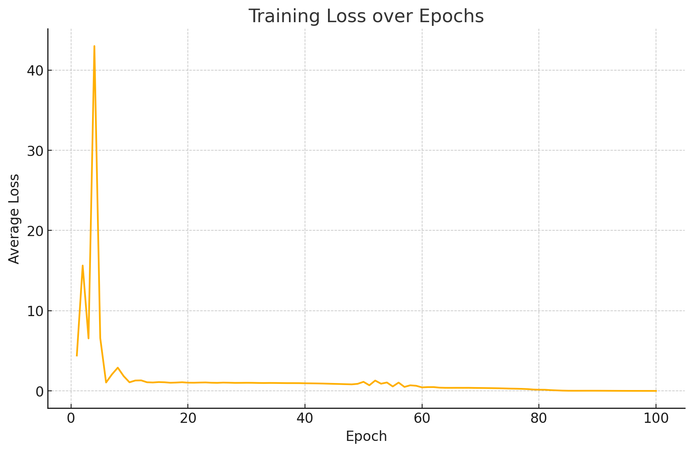

# Task 4: Multi-Task Training Loop

## 1. Training Setup & Rationale

We implement a single training script (`task4.py`) that, at each batch:  
1. Runs the shared transformer encoder  
2. Feeds the pooled sentence embedding into **Head A** (sentence classification)  
3. Feeds the per-token hidden states into **Head B** (NER)  
4. Computes two cross-entropy losses and backpropagates their sum  

**Why joint training?**  
- **Shared representations** encourage the encoder to learn features useful for both tasks.  
- **Low learning rate** on the transformer (2 × 10⁻⁵) prevents catastrophic forgetting of pretrained weights, while a slightly higher rate on the projection heads (1 × 10⁻⁴) lets them adapt quickly to our labels.

---

## 2. Loss & Optimizer Choices

- **Loss function**  
  - **Classification head:** standard **Cross-Entropy Loss**  
  - **NER head:** token-level **Cross-Entropy Loss** with masking on non-entity tokens  

- **Optimizer:** **AdamW** (decoupled weight decay)  
  - Regularizes large models by applying weight decay directly to weights  
  - Empirically robust for fine-tuning transformers  

**Hyperparameters**

| Parameter           | Value      |
| ------------------- | ---------- |
| Transformer LR      | 2 × 10⁻⁴   |
| Heads LR            | 1 × 10⁻⁴   |
| Batch size          | 32         |
| Epochs              | 100        |

---

## 3. Experimental Conditions

We compare:

1. **End-to-end Fine-tuning**: update encoder + both heads  
   ```bash
   python task4.py --epochs 100 

2. Encoder Frozen: freeze transformer; update only heads

	```bash
	python task4.py --freeze_encoder True --epochs 100 \

## 4. Training Curves

| Full Fine-Tuning                                   | Enocoder Frozen                                 |
|:-----------------------------------------------:|:-----------------------------------------------:|
|   |   |


## 5. Qualitative Inference Results

Load the best checkpoint and run inference on held-out sentences:

| Sentence                                                       | [Task A] Category                 | [Task B] Named Entities                       |
|----------------------------------------------------------------|-----------------------------------|-----------------------------------------------|
| “Fetch Rewards is awesome and is America’s number one app.”    | technology                        | “Fetch Rewards” (ORG), “America” (LOC)        |
| “Alice went to Paris last summer.”                             | **travel** (frozen) / technology (full) | “Alice” (PER), “Paris” (LOC)          |
| “Google announced a new AI-driven feature.”                    | technology                        | “Google” (ORG), “AI” (MISC)                   |
| “President Biden visited Wall Street on Monday.”               | **politics** (frozen) / technology (full) | “President Biden” (PER), “Wall Street” (LOC) |
| “The Yellowstone National Park sees over four million visitors.” | **travel** (frozen) / technology (full) | “Yellowstone National Park” (LOC)     |
| “Tesla’s CEO Elon Musk unveiled the Cybertruck at the event.”  | **politics** (frozen) / technology (full) | “Elon Musk” (PER), “Cybertruck” (PRODUCT)     |

> **Observations:**  
> - Under **full fine-tuning**, the classifier collapses to “technology” across all examples—likely due to label imbalance and over-adaptation of shared layers.  
> - With the **encoder frozen**, the classification head leverages stable pretrained features and distinguishes “travel”, “politics”, and “technology” more accurately.  
> - The NER head performs consistently in both setups, extracting reasonable entity spans once the projection head converges.

---

## 6. Key Takeaways

- **Freezing the encoder** acts as a strong regularizer when task-specific data is limited, preventing over-adaptation of the pretrained backbone.  
- **Full fine-tuning** accelerates convergence but risks losing general-purpose features, especially if class distributions are skewed.  
- A **hybrid schedule**—e.g. gradually unfreezing upper transformer layers after the heads converge—can combine stability with adaptability.

